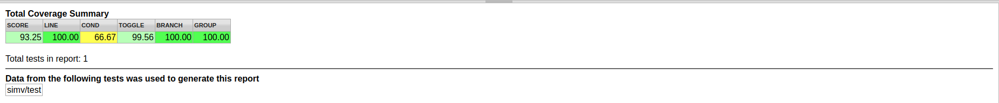

# INT_FP_MAC

The design is a multiplier accumulator (MAC) support both INT8 and FP16 data format. The whole design is ASIC-specific and fully sythesizable independent of any IPs.

## Design

The basic MAC element is multiplier and adder. We use Vedic Multiplier and Carry Look-ahead Adder (CLA) to perform multiply and accumulator.

## Synthesis

The Synthesis process is completed by Design compile with TCL script, Maximum operating frequency is about 200M Under the tsmc090 process.

## Verification

The verification process is carried out with directed testing and UVM (a state-of-art constraint-random verification methodology). Test plan is made as follows.

| Purpose                 |Methodology|Language|Status|
|:------------------------|:------------------------|:----|:-----|
| Adder Function          |Directed                 |Verilog|Passed|
|Multiplier Function      |Directed                 |Verilog|Passed|
| Adder in FP16 mode      |Directed                 |Verilog|Passed|
| Multiplier in FP16 mode |Directed                 |Verilog|Passed|
| MAC Function            |UVM (Constraint Random)  |SystemVerilog|Passed|

### Coverage

